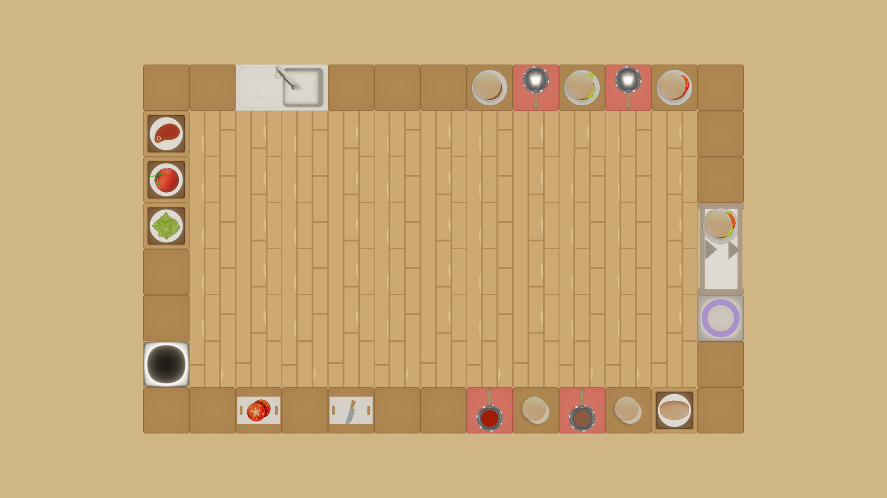

# Wollok-King 

Juego inspirado en el juego [Overcooked 2](https://store.steampowered.com/app/728880/Overcooked_2/), donde demuestras que puedes preparar los pedidos en un tiempo limite.

## Equipo de desarrollo

- Juan Schmidt
- Juan Pablo Bianchi
- Pablo Martin Favilli
- Martin Balsamo
- Lucia Castro

## Capturas

## Objetivo

Conseguir la mayor cantidad de puntos posibles, esto se consigue entregando los pedidos que aparecen a la derecha de la pantalla.

## Como hacer los pedidos

Para que un plato sea entregable, debe ser exactamente como lo pide el pedido, en caso contrario no obtendras puntos.

## Más cosas sobre el juego

- No puedes poner los ingredientes sobre cualquier cosa, primero debe haber un plato sobre una mesada, luego colocar el pan, el resto de los ingredientes pueden ser colocados de manera aleatoria.

- Si pones a cocinar algo, espera a que este listo y agarralo.

- Para cocinar la carne, primero debe ser cortada para sacar la grasa y el hueso.

- El plato solamente puede ser colocado en las mesadas, en la basura en caso de haberte equivocado en la preparación, o en la zona de entrega si el pedido esta listo.

- Los ingredientes solamente pueden colocarse en la tabla de picar, la hornalla, en el basurero o encima del pan. Pero las verduras no pueden colocarse encima de la hornalla ya que no es necesario el cocinarlas.

- Para cortar o cocinar los ingredientes se deben soltar sobre el objeto que deseas y luego apretar la tecla de acción las veces que sean necesarias para que se procese el cambio de estado.

- Si el pedido no es entregado a tiempo, el cliente se irá y cancelará su pedido.

## Controles

- Movimientos
	- W - Arriba
	- A - Izquierda
	- S - Abajo
	- D - Derecha
- Space - Soltar/Agarrar
- E - Acción

## Otros

- Objetos 1 - Comision 1 - T.Noche - Universidad Nacional de Hurlingham
- Versión 3.0.0 de wollok 
- Una vez terminado, queremos manternerlo privado
